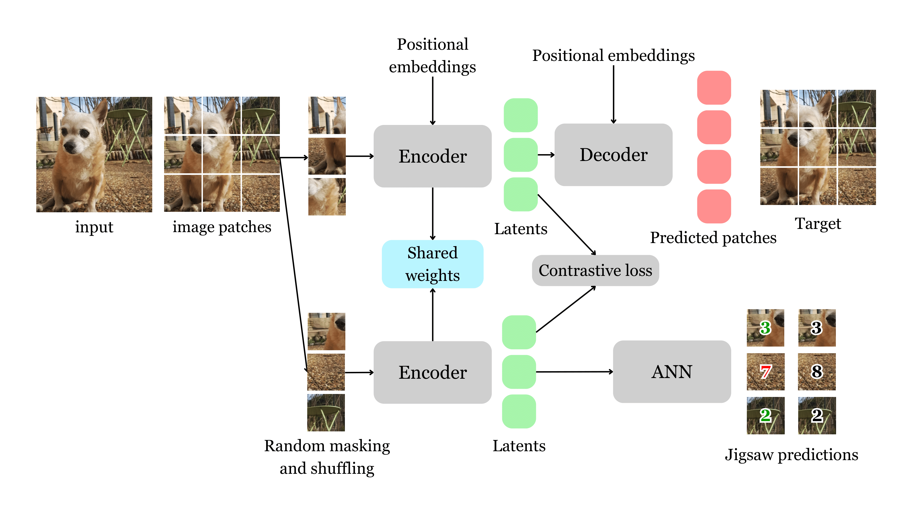

# SJ-MAE: Joint Masked, Jigsaw, and Contrastive Pretraining for Vision Transformers

Welcome to the official repository for the paper **"SJ-MAE: Joint Masked, Jigsaw, and Contrastive Pretraining for Vision Transformers"**!  
Our approach integrates multiple self-supervised objectives—masked autoencoding, jigsaw spatial reasoning, and contrastive learning—into a single, unified ViT encoder.

---

  
*Overview of the SJ-MAE framework.* The model builds on Masked Autoencoders (MAE) by introducing two lightweight, auxiliary branches: (1) a *jigsaw task branch*, which promotes spatial reasoning by predicting the permutation of shuffled visible patches, and (2) a *contrastive branch*, which enhances instance-level discrimination by aligning different views of the same image. All three tasks share a single ViT encoder, encouraging the learning of both global semantics and local structure through multi-task supervision.

---

## Abstract
Self-supervised learning (SSL) has emerged as a powerful paradigm for learning visual representations without labels. While most approaches focus on a single pretext task such as masked image modeling or contrastive learning, this limits the diversity of supervisory signals and the generality of learned features. In this work, we explore a multi-task approach to SSL and propose \textbf{SJ-MAE}, a unified framework that jointly combines \emph{masked image reconstruction}, \emph{jigsaw spatial reasoning}, and \emph{siamese contrastive task} within a single Vision Transformer (ViT) encoder. Each task contributes complementary inductive biases, encouraging the model to capture both local structure and global semantics. We analyze the synergy between these tasks, study the impact of loss balancing, and evaluate the resulting representations across several transfer benchmarks. Our results show that SJ-MAE consistently outperforms single-task baselines and prior dual-task methods, confirming the value of multi-task SSL for robust and transferable vision models.

## Repository Structure
The code will generate missing folders if they do not exist.
```
/
|- configs/               # Directory for configuration files
|- models/                # Directory containing model implementations
|- util/                  # Utility code directory
|- main_pretrain.py       # Script to run pretraining (usage: `python main_pretrain.py --config configs/config.yaml`)
|- main_linprobe.py       # Script to run linear probing
|- main_finetune.py       # Script to run finetuning
|- engine_finetune.py     # Utility functions for linear probing and finetuning
|- engine_pretrain.py     # Utility functions for pretraining
|- LICENSE                # License file
|- README.md              # Readme file
|- requirements.txt       # File listing the project dependencies
```

## Getting Started


To get started with this repository, first clone it and install the required dependencies:

```
git clone https://github.com/JulesCollenne/SJ-MAE.git
cd SJ-MAE
pip install -r requirements.txt
```
Ensure you customize the configuration files according to your needs. Then, you can begin the pretraining process by running:
```
python main_pretrain.py --config configs/config.yaml
```

##  Citation
Soon!

## Acknowledgements

This repository builds upon the following prior work:

- [MAE (Masked Autoencoders)](https://github.com/facebookresearch/mae) by He et al., CVPR 2022 – for the backbone architecture and reconstruction framework.
- [Jigsaw-ViT]([https://github.com/ubc-vision/Jigsaw-ViT](https://github.com/yingyichen-cyy/JigsawViT)) by Chen et al., Pattern Recognition Letters – for the spatial reasoning task and permutation prediction.
- [SimCLR](https://github.com/google-research/simclr) by Chen et al., ICML 2020 – for the contrastive learning formulation and augmentation pipeline.

We thank the authors for their contributions to open-source research.

